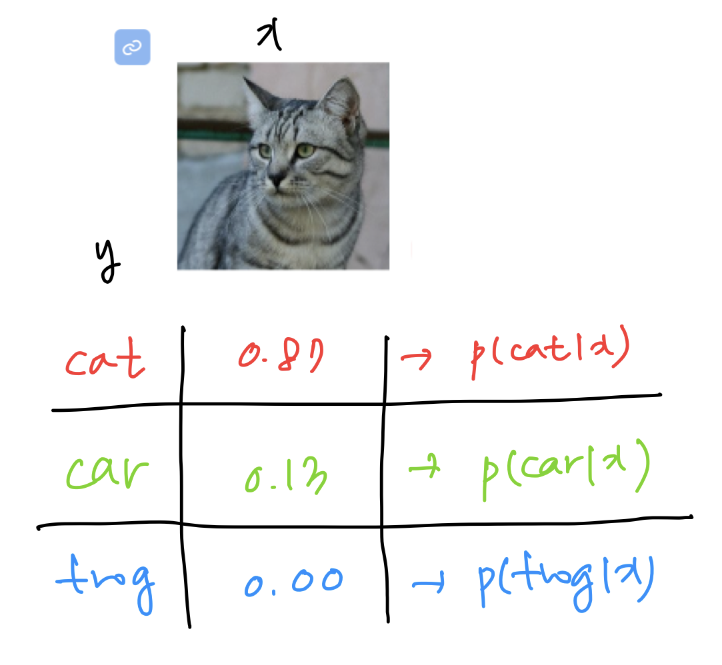
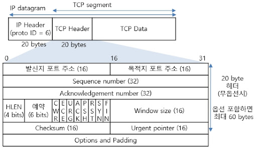

<!--more-->

## TCP/UDP를 살펴보기 전에 - 네트워크, 프로토콜은 뭐지?

TCP/UDP가 "컴퓨터 네트워크"라는 학문에서 어디에 위치하고 있는지 알기위해, 컴퓨터 네트워크와 프로토콜의 개념을 먼저 살펴보자.

네트워크란 컴퓨터 기기들이 통신할 수 있도록 연결해주는 시스템이고, 이때 통신은 기기간의 데이터 전송(송신과 수신)을 의미한다. 데이터를 전송하려면 전송 방식, 전송 경로, 데이터 보호 방식 등 여러가지를 정해야 하는데, 이를 위해 사람들이 정해둔 규칙이 바로 프로토콜이다.

### OSI 7계층, TCP/IP 4계층
OSI 7계층은 네트워크 통신이 일어나는 과정을 7가지 계층으로 나눈 것이다. 계층을 나눔으로써 문제가 생겼을 때 어디의 문제인지 세분화해서 대응할 수 있다. TCP/IP 4계층 또한 같은 네트워크 계층 모델로, OSI보다 더 간단하고 실용적인 목적으로 개발됐다.

TCP/IP 계층 모델의 이름에 오늘 살펴보려고 하는 "TCP"가 있는데, 이 TCP가 이 글에서 다루는 TCP가 맞다!

OSI 7계층이나 TCP/IP 4계층 모두 각 계층별로 프로토콜을 정리했는데, TCP/UDP는 이중 전송계층에 해당하는 프로토콜이다.(사진에서 Transport에 해당)

네트워크 모델 자체가 데이터 송수신에 대해 다루고 있는데 왜 전송계층이 따로 있는지 헷갈릴 수 있다. Transport 계층은 애플리케이션 계층과 인터넷 계층 사이에 있는데, 인터넷 계층의 역할이 데이터를 수신 컴퓨터(호스트)까지 전달하는 것이라면, Transport 계층은 컴퓨터(호스트)가 받은 데이터를 애플리케이션까지 전달하는 것이다.


호스트, IP, 포트, 애플리케이션 .. 이런 개념을 잠깐 정리해보자면, 

컴퓨터==호스트

호스트를 식별할 수 있도록 번호를 부여한 것이 **IP**, 애플리케이션을 식별할 수 있도록 번호를 부여한 것이 **포트번호** 이다!


### 그래서 TCP/UDP란
즉, TCP와 UDP는 Transport 계층에서 컴퓨터부터 애플리케이션까지의 데이터 전송을 다루는 프로토콜이다. 

Transport 계층의 또 다른 중요한 역할은 "신뢰성" 있는 데이터 전송인데, 여기서 신뢰성이란 패킷을 유실하지 않고 목적지까지 보낸다는 뜻이다. 이에 더불어 패킷을 순서대로, 오류 없이 보내는 것도 신뢰성의 한 축인데, 이를 위한 프로토콜이 TCP이다. 이를 실현하기 위해 TCP는 송신자와 수신자 간 연결형 방식이고, 여러가지 제어방식을 가지게 된다.

반면 UDP는 속도에 더 초점을 맞추는 프로토콜이다. 이에 따라 UDP는 비연결형 방식을 취하게 되고(연결을 확인하는데 시간이 걸리므로) 간단한 오류 처리이외에 별도로 제어방식을 사용하지는 않는다.  

## TCP
위에서 언급했듯, TCP는 신뢰성 있는 데이터 전송을 위한 연결 지향 방식이고, 이에 더불어 여러 제어 방식을 취한다. 

연결을 지향한다는 것은, 송신자와 수신자가 계속 소통한다는 뜻이다. 연결을 확인하지 않는 UDP와 비교해서 이해하면 쉽다.

TCP | UDP
 -- | -- |

### TCP Handshake
TCP는 송신자와 수신자의 연결을 확인하고, 연결을 해제하기 위해 Handshake라는 방식을 사용한다. 

사진의 SYN, ACK, FIN은 연결과 관련된 FLAG로, binary 값을 보내면서 서로 소통한다.
| FLAG | 설명 |
| --- | --------------------------------- |
| SYN | 접속 요청시 보내는 패킷                     |
| ACK | 상대방으로부터 패킷을 받은 후, 잘 받았다고 알려주는 패킷 |
| FIN | 접속 종료를 위한 패킷                      |

이 FLAG들은 TCP 세그먼트 헤더에 포함된다.

TCP 세그먼트 헤더는 FLAG말고도 여러 정보를 포함하고 있는데, 간단하게 살펴보자면

**Source Port, Destination Port** : 출발, 도착하는 포트 번호

**Sequence number** : 데이터의 순서를 보장하기 위해 해당 데이터 조각이 몇번째인지 알려줌. 첫 데이터 전송 시 난수로 생성됨

**Acknowledgement number** : 송신쪽에서 보낸 데이터 세그먼트를 받았음을 알리는 누적번호로, 다음에 받을 번호 표시

**window size** : 한 번에 전송할 수 있는 데이터의 양을 나타냄 -> 흐름제어에서 사용됨

그럼 이제 위에서 언급한 TCP flag와 헤더를 사용하는 Handshake 과정을 살펴보자. 기억할 것은 어느쪽이든지 SYN을 보내면, 받았음을 확인해주는 ACK를 보낸다는 것이다.

* 3-way Handshake (연결 확인)



1. 연결을 확인하기 위해 클라이언트가 서버에 SYN을 보내고 SYN_SENT 상태로 대기한다.
2. 서버는 클라이언트로부터 SYN을 받았으므로 ACK를 보내고 SYN_RCVD 상태가 된다. 또, 반대로 클라이언트의 연결을 확인하기 위한 SYN을 보낸다.
3. 클라이언트는 서버로부터 SYN을 받았으므로 ACK를 보낸다. SYN, ACK 둘다 보내고 받았으므로 Established 상태가 된다. 
4. 서버도 SYN, ACK 둘 다 보내고 받았으므로 Established 상태가 된다. 양쪽이 연결을 확인하고 답했으므로 준비완료.

* 4-way handshake (연결 해제)



1. 데이터를 전부 전송한 클라이언트가 서버에 FIN을 보내고 FIN_WAIT1 상태로 대기한다.
2. 서버가 CLOSE_WAIT 상태로 변경되고 해당 포트에 연결되어 있는 애플리케이션에 CLOSE()를 요청한다. FIN을 받았으니까 클라이언트에 ACK를 보낸다.
3. 클라이언트는 FIN_WAIT2 상태로 대기하며 혹시 남은 패킷이 송신되기를 기다린다.
4. CLOSE() 요청을 받은 애플리케이션은 종료 프로세스를 진행하고, LAST_ACK 상태가 되면서 클라이언트에 종료를 확인하는 FIN을 보낸다.
5. FIN을 받았으니 클라이언트가 ACK를 보내고 TIME_WAIT 상태가 된다. 종료가 확인되었으니 모든 포트가 CLOSED된다.

### TCP 제어 방식

흐름 제어 (Flow control)
데이터 전송시에 송신 속도와 수신자가 감당할 수 있는 속도가 차이가 날 수 있다. 흐름 제어는 이러한 상황에 대비해 송신 측의 데이터 전송량을 조절하는 제어 방식이다.

* 슬라이딩 윈도우
    윈도우 사이즈로 데이터 전송 속도를 조절한다. 윈도우 사이즈에 해당하는 만큼만 데이터를 보내고, 다 보내고 나면 밀어서 다음 데이터를 또 윈도우 사이즈만큼 보낸다.
    
    

오류 제어 (Error control)

오류 제어는 오류가 발생하면 데이터를 재전송할 수 있도록 한다. 

* Go Back N 

    

오류가 발생한 위치로 돌아가 다시 차례로 전송한다.

* Selective Repeat

    

오류가 발생한 위치로 돌아가는 건 같으나, 그것만 다시 전송한다.

혼잡 제어 (Congestion control)
네트워크에 패킷이 과도하게 많아 네트워크 속도가 감당할 수 없는 상황을 제어한다.

* AIMD

    

AIMD는 Additive Increase Multiplicative Decrease 의 줄임말로, 패킷을 하나씩 보내고 문제가 생기지 않으면 윈도우 사이즈를 하나씩 늘려준다(Additive Increase). 그러다가 패킷 전송에 실패하면 윈도우 사이즈를 절반으로 줄인다(Multiplicative Decrease).

## UDP

연결을 확인하고, 다양한 제어 방식을 두는 TCP와 다르게 UDP는 보다 간단하고 빠른 프로토콜이다.

UDP의 헤더를 살펴보자.

Sequence number나 Acknowledge number로 패킷 순서를 보장하고, 연결 확인을 위한 FLAG를 뒀던 TCP의 헤더와 달리 UDP 헤더는 심플하다. 출발과 도착 포트 번호가 있고, checksum으로 간단한 오류를 확인하는 정도다. 

또한 데이터를 세그먼트 단위로 나눠서 전송하는 TCP와 다르게, 데이터그램 단위로 헤더를 붙여서 송수신한다. 순서를 맞추는 Sequence number가 없는 것도 이 맥락이다. 

즉 간단한 헤더 구조와 연결 확인 과정이 없어 신뢰성보다 속도에 비중을 둔 프로토콜이라고 정리할 수 있다.

## TCP와 UDP 비교

| 항목 | TCP | UDP |
| --- | ---------------- | ----------------- |
| 연결 | 연결 지향 | 비연결방식 |
| 순서 | 순서 보장 | 순서 보장 x |
| 신뢰성 | 높음 | 낮음 |
| 속도 | 느림 | 빠름 |
| 통신 | 1:1 | 1:1, 1:N, M:N |

TCP는 연결 설정과 다양한 제어 방법으로 패킷을 손실 없이 전송할 수 있어 신뢰성이 높지만, 매번 연결 설정을 해야 하기 때문에 속도가 느리다. 반면 UDP는 
하지만 이런 프로세스가 없기 때문에 속도가 빠르고, 1:1, 1:N, M:N 통신 모두 가능해서 실시간 속도가 중요한 스트리밍이나 게임 등에 더 적합할 수 있다!

## Reference

[네트워크 개념, OSI 7계층, TCP/IP](https://www.officedepot.co.kr/item/itemView.do?currentPageNo=1&phone=&eventId=10030018368353&email=&itemId=1000000088097&limitPrice=&kw=&kw3=&eventList=%EB%A9%94%EC%9D%B8%EC%9D%B4%EB%B2%A4%ED%8A%B8%EA%B8%B0%ED%9A%8D%EC%A0%84)

[네트워크 계층 모델과 프로토콜_OSI 7계층과 TCP/IP 4계층](https://blog.naver.com/gilbutzigy/223235770275)

[Transport Layer | 전송 계층](https://yoeubi.github.io/network/Frontend-TCP-IP-3)

[TCP/IP 전송 계층(Transport)과 포트(Port) 번호 | 복습 ∨](https://forward-movement.tistory.com/188)

[위 글이 참조](https://better-together.tistory.com/134?category=887984)- 짱

[TCP 헤더](https://velog.io/@hyorard-b/TCP-%ED%97%A4%EB%8D%94)

[TCP의 흐름 제어 / 오류 제어 / 혼잡 제어](https://benlee73.tistory.com/186)

[TCP/IP - 전송계층 TCP 세그먼트 헤더(segment header)](https://blog.naver.com/4717010/60212483299)

