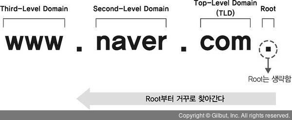
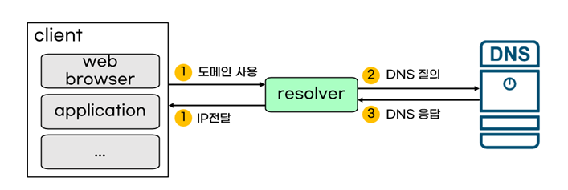

<!--more-->

DNS(Domain Name System)란 도메인과 IP를 매핑해주는 시스템이다. 

## 도메인과 IP
네트워크에 연결되어 있는 장치를 **호스트(host)**라고 한다. 데이터의 송수신은 여러 호스트들이 서로 요청과 응답을 주고받음으로써 이루어지는데, 우리가 많이 들어본 서버/클라이언트도 여기서 요청을 보내는 호스트/응답하는 호스트를 부르는 이름이다. 그렇다면 무수히 많은 호스트를 어떻게 구별할 수 있을까? 바로 IP다. IP는 각 호스트를 구별하기 위해 주어지는 번호이다.

그렇다면 웹 브라우저에서 주소창에 url을 입력해 해당 서버에 요청을 보내는 과정을 생각해보자. 해당 서버에 요청을 보내려면 IP를 알아야 할 것 같은데, 우리는 IP 주소(XXX.XXX.XXX.XXX 같은)을 입력하지 않고, 문자열로 된 주소를 입력한다.

예를 들어 이 블로그 주소를 보자.

https://braveseokyung.github.io/

이 주소에는 IP번호는 없지만, 내 아이디와 깃헙에서 호스팅했음을 알 수 있는 github 등 우리가 의도한 바를 담을 수 있는 정보들이 있다. 이렇게 사용자의 의도를 반영한 문자열 주소를 **도메인(Domain)**이라고 한다.

위 주소에서 https(이건 프로토콜을 나타낸다)를 제외한 braveseokyung.github.io가 도메인에 해당한다.

그렇다면 어떻게 도메인만으로 우리가 찾고자 하는 IP를 가진 서버에 요청을 보낼 수 있을까? 이때 등장하는 것이 DNS이다.

## DNS

DNS는 도메인과 IP를 매핑해주는 시스템이다. 즉 웹 브라우저에서 도메인을 입력하면, DNS가 거기에 맞는 IP 주소롤 반환해줘서 해당 서버에 요청을 보낼 수 있게 한다. 

비유하자면, IP가 도로명 주소라면 도메인의 그 도로명 주소의 건물이름이다.

DNS가 어떤 역할을 하는지 알았으니, 이제 좀 더 자세하게 구성요소부터 매핑하는 방식을 살펴보자!

## DNS 구성요소

DNS는 크게 도메인 네임스페이스, 네임서버, 리졸버로 구성되어있다.

왜 이렇게 구성되어있는지 살펴보기 전에, 질문을 해보자.


만약 도메인과 IP 주소를 매핑해주는 정보가 모두 하나의 서버에 저장되어있다면 어떻게 될까?


만약 이렇게 한 서버에 모든 정보가 저장되어있다면 어느 사이트에 들어가려고 해도 그 서버를 거쳐야 해서 서버의 부하도 커지고 속도도 느려질 것이다. 그렇다면 서버를 나눠서 저장해야 할 텐데,


정보를 나눠서 저장한다면, 클라이언트가 요청한 도메인에 대응되는 IP가 있는 서버를 어떻게 찾을 수 있을까?


### 도메인 계층구조

위의 질문을 해결하는 것이 도메인/DNS 서버의 계층구조이다! 
도메인 주소를 보면 '.'으로 나뉘어져 있는데, 이 '.'을 기준으로 계층이 나뉜다.

도메인에서 역순으로 상위에서 하위계층이다. 가장 상위 계층인 루트는 일반적으로 생략되고, 'com' , 'kr'등은 Top-Level Domain(TLD), 'naver' , 'tistory' , 'github' 등 그 다음에 오는 것이 Second-Level Domain(SLD), 마지막으로 Third-Level Domain 또는 Sub-Domain이 있다.

[사진출처](https://thebook.io/007046/0045/)

그리고 DNS 서버 도메인의 계층구조에 따라 노드별로 배치되고, 상위서버는 하위서버에 대한 정보를 가지고 있어 하위 서버의 주소를 반환하거나 요청을 보낼 수 있다. 도메인과 똑같이 루트 서버, TLD 서버, SLD 서버(Authorative Server)로 나뉜다.



정보를 서버마다 나눠서 저장하더라도, 이러한 계층구조를 통해 정보를 상위 도메인의 서버에서 하위 도메인의 서버로 이동하면서 도메인의 IP를 가지고 있는 서버를 찾아갈 수 있는 것이다!

도메인과 DNS 서버의 계층구조를 이해했다면, 다시 DNS 구성요소로 돌아와보자.



* 도메인 네임 스페이스 : 앞에서 설명한 도메인의 계층구조를 이르는 말
* 네임 서버 : 각 노드에 배치된 도메인과 IP에 대한 정보를 가지고 있는 서버
* 리졸버(Resolver) : 리졸버는 클라이언트와 DNS 서버의 매개체로, 클라이언트가 요청한 도메인에 대해 DNS 서버에 조회 메시지(쿼리)를 보내고 IP 주소를 응답으로 받아 다시 클라이언트에게 준다.

[사진출처](https://malwareanalysis.tistory.com/631)

## DNS 쿼리

위에서 도메인과 DNS 서버는 도메인 네임 스페이스라고 부르는 계층구조로 이루어져있고, 이 계층 구조에 따라 각 네임서버에 자신의 하위서버에 대한 정보가 저장되어있다는 것을 알게됐다. 하지만 구체적으로 어떻게 최종적으로 원하는 도메인의 IP를 찾을 수 있는지 알려면, DNS 쿼리에 대해 알아야 한다.

DNS 쿼리란 말 그대로 각 DNS 서버에게 '너 이 도메인의 IP 주소를 가지고 있어?'라고 물어보는 방법이다. DNS 쿼리에는 두 가지 방식이 있는데, 바로 Recursive Query와 Iterative Query이다.

### Recursive Query
Recursive Query는 말 그대로 루트 네임 서버에서 시작해 상위 네임 서버에서 하위 네임 서버로 원하는 도메인의 네임 서버가 나올 때까지 재귀적으로 쿼리하는 것이다. 여기서의 중요한 특징은 클라이언트의 리졸버를 통한 최초 요청은 한 번 뿐이고, 이외의 쿼리는 DNS 서버 간(상위 서버가 하위 서버에 물어보는 방식으로) 이루어진다는 것이다. 

사진으로 보면 이해가 편한데,


www.google.com을 찾는다고 하면 클라이언트가 리졸버를 통해 최초의 요청을 보내고, 루트 네임 서버에 질의한다. 루트 네임 서버는 'com'을 담당하는 TLD 서버에 쿼리하고, TLD 서버는 다시 하위 google SLD 서버에, SLD 서버는 자신의 하위 www 서버에 질의한다. 최종 www 서버에서 www.google.com의 IP 주소를 찾으면 클라이언트는 한번의 요청으로 응답을 받을 수 있게 된다.

### Iterative Query
Iterative Query는 각 DNS 서버가 직접 쿼리하는 것이 아니라 하위 서버의 주소만 반환해주면서 리졸버가 그 주소의 서버에 반복적으로 질의하는 방식이다. Recursive Query와 비교해보면 한 번의 요청으로 최종 노드까지 타고 들어가는 방식이 아니라, 여러번 요청하면서 원하는 노드를 찾아낸다.

### Recursive Query와 Iterative Query 비교


Recursive Query는 상위 서버가 하위 서버에 직접 요청하면서 원하는 결과를 얻을 때까지 재귀적으로 들어가는 방식, Iterative Query는 상위 서버가 하위 서버의 주소만 반환해주면서 쿼리는 리졸버에게 맡기는 방식이다.

즉 Recursive Query의 리졸버가 보내는 요청은 한 번, Iterative Query에서는 여러 번이라는 것이 가장 큰 차이이다. 

## DNS 동작 과정



전체적인 동작 과정은 다음과 같다.

1. 클라이언트가 도메인에 대한 IP 주소를 찾아달라고 요청을 보낸다
2. 이때 먼저 hosts 파일을 찾아보는데, 운영체제에 기록되어 있는 기본 정보이다.
3. hosts 파일에 없으면 리졸버를 통해 로컬 DNS 서버를 찾아본다
    로컬 DNS 서버는 각 기지국 등이 가지고 있는 서버로, 여기에서도 이전에 찾았던 도메인에 대해 캐싱이 되어 있어 여기서 원하는 도메인을 찾으면 IP주소가 반환되고 끝난다.
4. 로컬 DNS 서버에서 찾지 못했으면, DNS 쿼리 과정을 통해 루트 서버부터 순차적으로 찾아본다.
5. 쿼리를 통해 원하는 네임서버를 찾아 IP 응답을 받으면 리졸버가 그 응답을 클라이언트에 전달한다!

## 추가로 알아볼 내용
리졸버(socket 부품이래), DNS 스푸핑, DNS에서 UDP 사용

## Reference
* [IP 주소와 도메인의 관계](https://m.blog.naver.com/pxkey/221216492103)
* [DNS-개념잡기-2-DNS-구성-요소-및-분류(DNS-Resolver-DNS-서버)](https://anggeum.tistory.com/entry/DNS-%EA%B0%9C%EB%85%90%EC%9E%A1%EA%B8%B0-2-DNS-%EA%B5%AC%EC%84%B1-%EC%9A%94%EC%86%8C-%EB%B0%8F-%EB%B6%84%EB%A5%98DNS-Resolver-DNS-%EC%84%9C%EB%B2%84)
* [DNS Recursive Query를 직접 해보자](https://blog.sysbot32.com/entry/DNS-Recursive-Query%EB%A5%BC-%EC%A7%81%EC%A0%91-%ED%95%B4%EB%B3%B4%EC%9E%90)
* [HTTP 통신과정, 리졸버를 이용한 DNS 서버에서 IP 조회하기](https://wonsjung.tistory.com/614)
* [DNS 이해](https://malwareanalysis.tistory.com/631)
* [DNS 쿼리, DNS의 쿼리 처리](https://croquisine.com/dns-%EC%BF%BC%EB%A6%AC-%EC%B2%98%EB%A6%AC/) - DNS Resolver와 Local DNS Server의 차이
* [DNS 개념 & 동작 ★ 알기 쉽게 정리](https://inpa.tistory.com/entry/WEB-%F0%9F%8C%90-DNS-%EA%B0%9C%EB%85%90-%EB%8F%99%EC%9E%91-%EC%99%84%EB%B2%BD-%EC%9D%B4%ED%95%B4-%E2%98%85-%EC%95%8C%EA%B8%B0-%EC%89%BD%EA%B2%8C-%EC%A0%95%EB%A6%AC)
* [DNS는 어떻게 동작하는가](https://kghworks.tistory.com/126)