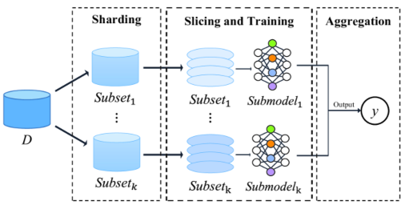

<!--more-->

딥러닝에서 모델이 데이터를 학습하는 과정을 "learning"이라고 합니다. 그러면 반대로 모델이 배운 것을 까먹게 할 수도 있을까요? 이미 학습된 모델에서 특정 데이터를 잊도록 하는 task를 "Machine Unlearning"이라고 합니다. 

## Why Unlearning?

모델을 기껏 학습해놓고 왜 까먹게 할까요? 사실 Machine unlearning은 이전까지는 상대적으로 그 필요성이 실감되지 않아 비교적 최근에 많은 연구가 이루어지고 있는 분야입니다. 학습에 엄청난 양의 web-scale 데이터셋이 활용되고, 또 그렇게 학습된 모델을 가지고 생성을 하는 경우가 많아지면서 여러가지 문제가 드러나게 되었습니다.


출처 : [Machine Unlearning in Generative AI: A Survey](https://arxiv.org/abs/2407.20516)

사진에서 보이는 것처럼 악용의 소지가 있는(범죄에 활용될 수 있거나 선정적인 ..) 내용, bias를 담고 있는 내용, 저작권에 위배되는 내용이 생성될 수 있는 것이죠! 

generative model 이전에도 직접적으로 확인할 수 없어 부각이 덜 되었을 뿐, 모델을 공격하여 데이터를 역으로 추적하거나, 고객이 개인정보의 삭제를 요청하거나 하는 상황에서 model unlearning의 필요성이 제기되었습니다.

개인적으로 unlearning이 점점 중요하게 될 것이라고 생각하는데, safety 뿐만 아니라 model management 차원에서도 unlearning이 필요하기 때문입니다.

Chat-GPT가 학습된 시점은 2021년인데, 시간이 지날수록 2021년에는 맞았지만 지금은 맞지 않은 정보들이 늘어나게 될 것이기 때문이죠. 그럴 때마다 모델의 모든 파라미터를 다시 학습시키는 것은 시간과 비용이 어마어마하게 많이 드는 일이기 때문에, 효율적인 unlearning 방법을 찾는 것의 중요성이 점점 커질 것이라고 생각합니다. 이러한 부분은 continual learning과도 맞닿아 있습니다.

## Unlearning이란?

Unlearning을 좀 더 엄밀하게 정의하자면, 모델에서 지우고자 하는 데이터의 영향(influence)를 지우는 것입니다. 딥러닝 모델은 수많은 파라미터로 이루어져는데, 해당 데이터를 학습함으로써 파라미터들에 미친 영향을 없애는 것입니다. 모델이 '잊는다'는 것은 모델의 output이 그 데이터를 학습하기 이전과 같아야 한다는 것이고요. 

본격적인 설명에 앞서 용어 정리를 하자면, 

출처 : [A Survey on Machine Unlearning: Techniques and New Emerged Privacy Risks](https://arxiv.org/html/2406.06186v1)

- 전체 데이터셋: $D$
- 모델이 잊어야 할 데이터셋 : forgetting dataset, $D_f$
- 전체 데이터셋에서 forgetting dataset을 제외한 데이터셋 : remaining dataset, $D_r$
- unlearning 이전 초기 모델 : initial model $f_{\theta_0}$ ($\theta$ as model parameter)

이러한 표기가 자주 사용됩니다.

### Retrain model as golden standard
가장 쉽게 생각할 수 있는 unlearning의 방식은 모델을 처음부터 다시 학습시키는 것입니다. 모델을 아예 scratch에서 forgetting dataset을 제외한 remaining dataset $D_r$만 가지고 학습시키는 것이죠. 이렇게 학습된 모델을 **Retrained model** 이라고 합니다. 가장 정확하지만, 기존 모델이 크면 클수록 엄청난 시간과 비용이 드는데다가, remaining dataset을 전부 관리하고 있다는 보장이 없기 때문에 때로는 불가능할 수도 있습니다.

그래서 Unlearning 연구에서는 이 retrain model을 golden standard로 두고, 이 모델과 같거나 유사한 모델을 보다 효율적인 방법으로 얻는 것을 목표로 합니다.

## Unlearning 방법론
방법론을 크게 나누면 Exact Unlearning과 Approximate unlearning이 있습니댜. 

### Exact Unlearning
Exact Unlearning은 말 그대로 retrain model을 "exact"하게 얻는 것을 목표로 합니다. 그래서 방법은 retrain에 기반을 두되, 보다 효율적인 방식을 위해 데이터나 모델을 subset으로 쪼개는 방식을 취합니다. 이러한 방법을 retrain acceleration이라고 합니다.

사진에서 볼 수 있듯이 데이터와 모델을 subset으로 쪼개서 학습한뒤, unlearning이 필요해지면 forggeting dataset이 속해있는 subset을 찾아 지우고 subset에 해당하는 부분만 다시 학습하는 방식입니다. 이렇게 하면 retrain model과 똑같은 결과를 얻을 수 있지만, 초기 모델을 train할 때부터 이렇게 해야 의미가 있기 때문에 train pipeline을 건드리게 되고, subset의 구분에 영향을 많이 받는다는 문제점이 있습니다. 만약 지우고자 하는 데이터가 모든 subset에 조금씩 걸쳐있다면 결국에는 전부 다 다시 학습해야 한다는 뜻이니까요!

### Approximate Unlearning

이러한 문제점으로 최근에는 Approximate Unlearning 방법들이 많이 연구되고 있습니다. Approximate unlearning은 retraining을 하지 않고 initial model $f_{\theta_0}와 데이터셋을 가지고 retrained model에 최대한 가깝도록 근사한 unlearned model $f_{\theta_*}를 만드는 것을 목표로 합니다.

모델을 근사하는 방법하기 위해 보통 모델의 parameter를 조작하는데, forgetting dataset의 영향을 크게 받은 parameter를 찾아서 바꾸는 방식입니다.

하지만 이러한 영향을 정확하게 파악하는 것이 복잡한 parameter space로 인해 어렵고, 또 모델의 수많은 parameter들이 서로 상호작용을 하면서 output을 뱉는 것이기 때문에 parameter를 건드리게 되면 다른 remaining dataset에 대한 결과도 영향을 받는 경우가 많습니다.

그래서 Approximate Unlearning 연구에서는 어떻게 remaining dataset의 성능은 보존하면서도 forgetting dataset의 영향을 지울 수 있는 방법을 찾는 것이 핵심입니다.

## Unlearning tasks in Computer Vision

### Image Classification 

Image Classification에서는 random unlearning과 class unlearning이 주요 task입니다. random unlearning은 전체 데이터셋에서 특정 비율(보통 10%)을 random하게 뽑아서 forgetting dataset을 만듭니다. 
class unlearning에서는 잊고자 하는 class의 모든 sample을 지우고 실험합니다. 예를 들어 숫자를 학습해서 분류하는 모델이 있다고 하면, '0'에 해당하는 sample을 다 forgetting dataset으로 삼습니다. 이상적으로 unlearn이 진행된다면, 모델은 0을 모르니 0이 들어왔을 때 다른 숫자들로 분류해야겠죠?!

classification인 만큼, random unlearning보다는 class unlearning이 직관적으로 해석이 되는 것 같습니다. 특정 "sample"을 잊는 것이 목표인 random unlearning을 한 후 classification accuracy를 측정한다면, 값이 낮아지기는 하겠지만 그 sample들의 class에 해당하는 다른 데이터를 많이 학습했기 때문에 generalization 측면에서 보면 accuracy가 너무 떨어지면 오히려 안되니까요. 반면 class unlearning은 그 class를 아예 모델이 보지도 못한 것처럼 unlearn하는 것이 목표이기 때문에 forgetting dataset에 대한 accuracy는 낮고, remaining dataset에 대한 accuracy는 높으면 돼서 잘 unlearn 되었다는 것을 직관적으로 파악할 수 있습니다.

### Image Generation

Image Generation에서는 보통 "concept erasing(forgetting, ablating ..)" 등등의 표현을 많이 씁니다. 예를 들어 "nudity"라는 concept을 잊어서 몸이 노출되는 이미지가 생성되는 것을 막는다, 이런 느낌입니다. 

Text-to-Image generation model에서는, 들어오는 prompt의 단어들을 기반해서 concept을 정의합니다. 이 concept는 object, class, style 등등 다양합니다. 
예를 들어 "an agricultural scenery painted by Van Gogh"면, Van gogh라는 painting style이 concept이 됩니다. 위에서 언급한 nudity는, I2P라고 부적절한 이미지를 생성하는 prompt가 있는데, 그 prompt들의 concept이 nudity가 됩니다.

최근 연구들을 보면, 지우고자 하는 target concept을 anchor concept으로 교체한 다음 diffusion model을 fine-tuning하는 방법으로 연구가 많이 진행되고 있는 것 같습니다.

특정 concept을 지운다는 것 그 concept을 disentangle 할 수 있다는 뜻이기도 해서, generation의 model decomposing이나 editing task와도 연결됩니다!